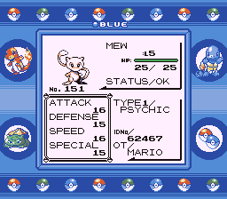
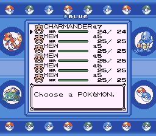
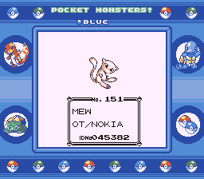
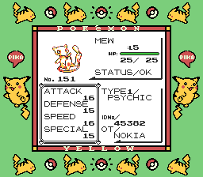
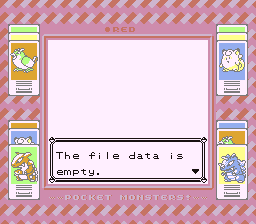

# Mew Machine (Rom Hack)

In recent years, I became interested the Gen 1 Mew event distributions, and I've tried to recreate the Mew Machine software as a hobby project. While I'm not a developer, I checked the code, experimented, and got help to make it work.
My goal was to authentically recreate the experience based on messages around the internet from people who attended the original events, since the actual distribution machines are likely lost to time.
I created a rom hack that allows players to receive Mew, as if they had attended the official event distributions. However, I don't have the skills to maintain or update it further for now. So don't expect next releases.

Changes were done mostly on:
- engine/movie/intro.asm
- engine/movie/oak_speech/oak_speech.asm
- engine/movie/trade.asm
- engine/movie/trade2.asm
- data/text/text_2.asm
- data/text/text_3.asm

It builds the following ROMs:

- Pokemon Red (UE) [S][!].gb `sha1: ea9bcae617fdf159b045185467ae58b2e4a48b9a`
- Pokemon Blue (UE) [S][!].gb `sha1: d7037c83e1ae5b39bde3c30787637ba1d4c48ce2`
- BLUEMONS.GB (debug build) `sha1: 5b1456177671b79b263c614ea0e7cc9ac542e9c4`
- dmgapae0.e69.patch `sha1: 0fb5f743696adfe1dbb2e062111f08f9bc5a293a`
- dmgapee0.e68.patch `sha1: ed4be94dc29c64271942c87f2157bca9ca1019c7`

To set up the repository, see [**INSTALL.md**](INSTALL.md). Keep in mind that this is an already old version of Pokered.

This is intended for use on PC or mobile with emulation mostly. To patch the ROM, Beat Patcher is recommended.
https://www.romhacking.net/utilities/893/

# How to use:

- 1. Copy any save file from Pokémon Red, Blue or Yellow, this save file should have at least 1 slot in the party available. (Make sure to do backups first just in case).
- 2. Paste the save file wherever you have the Mew Machine ROM. Make sure to rename the save file to have the same name as the Mew Machine ROM.
- 3. Load the Mew Machine ROM on your emulator.
- 4. Write a name for the OT for the Mew you want. (I.e: YOSHIRA, HAMBURG, FINLAND, etc)
- 5. Once selected, press A to send any amount of Mews (Max. 5).
- 6. Copy the updated save. Load it back to the original game (Red, Blue, Yellow), now you have Mew(s) in your party.

If you don't load a save file the game will display that is empty and will reset as a loop.

# Screenshots

# Credits

- **chatot4444**, **dannye33** for their help with the Trainer ID
- **Ajxpk** for their guidance
- **Ax461** for assistance and helping me fixing some bugs

## See also

- **Discord:** [pret][discord]
- **IRC:** [libera#pret][irc]
- **Project Pokémon post:** [ppkmn]
- **RHDN page:** [rhdn]

Other disassembly projects:

- [**Pokémon Red/Blue**][pokered]
- [**Pokémon Yellow**][pokeyellow]
- [**Pokémon Gold/Silver**][pokegold]
- [**Pokémon Crystal**][pokecrystal]
- [**Pokémon Pinball**][pokepinball]
- [**Pokémon TCG**][poketcg]
- [**Pokémon Ruby**][pokeruby]
- [**Pokémon FireRed**][pokefirered]
- [**Pokémon Emerald**][pokeemerald]

[pokered]: https://github.com/pret/pokered
[pokeyellow]: https://github.com/pret/pokeyellow
[pokegold]: https://github.com/pret/pokegold
[pokecrystal]: https://github.com/pret/pokecrystal
[pokepinball]: https://github.com/pret/pokepinball
[poketcg]: https://github.com/pret/poketcg
[pokeruby]: https://github.com/pret/pokeruby
[pokefirered]: https://github.com/pret/pokefirered
[pokeemerald]: https://github.com/pret/pokeemerald
[discord]: https://discord.gg/d5dubZ3
[irc]: https://web.libera.chat/?#pret
[ci]: https://github.com/pret/pokered/actions
[ci-badge]: https://github.com/pret/pokered/actions/workflows/main.yml/badge.svg
[ppkmn]: https://projectpokemon.org/home/forums/topic/65189-rom-hack-mew-machine/
[rhdn]: https://www.romhacking.net/hacks/8617/
